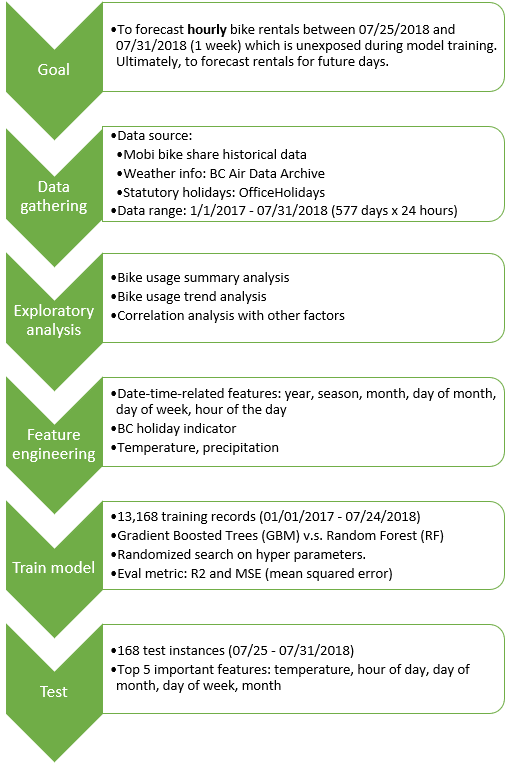

# Vancouver hourly and daily bike share forecasts

## Build GBM and Random Forest trees to predict hourly and daily bike share in downtown Vancouver

### Install

This project requires **Python 3.0+** and the following Python libraries installed:

- [NumPy](http://www.numpy.org/)
- [Pandas](http://pandas.pydata.org)
- [matplotlib](http://matplotlib.org/)
- [seaborn](https://seaborn.pydata.org/)
- [scikit-learn](http://scikit-learn.org/stable/)
- [XGBoost](https://xgboost.readthedocs.io/en/latest/python/python_intro.html)

You will also need to have software installed to run and execute an [iPython Notebook](http://ipython.org/notebook.html)

### Code

Code is provided in the notebook `bike_share_hourly_all_stations.ipynb` notebook file. 

### Run

In a terminal or command window, navigate to the top-level project directory `Vancouver-bike-share-forecast/` and run one of the following commands:

```ipython notebook bike_share_hourly_all_stations.ipynb```
```jupyter notebook bike_share_hourly_all_stations.ipynb```

This will open the iPython Notebook software and project file in your browser.

### Data
Data collected from:
- Historical bike rental data from [Mobi website] (https://www.mobibikes.ca/en/system-data)
- Statutory holidays: [OfficeHolidays] (https://www.officeholidays.com/)
- Weather information from [Air Data Archive] (https://www2.gov.bc.ca/gov/content/environment/air-land-water/air/air-quality/current-air-quality-data/bc-air-data-archive) by BC Government

### Project workflow
