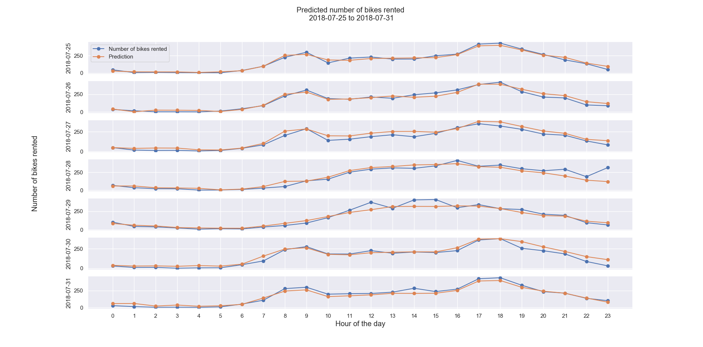

# Vancouver hourly and daily bike share forecasts

Build GBM and Random Forest trees to predict hourly and daily bike share in downtown Vancouver
Collected data from:
- Historical bike rental data from Mobi website (https://www.mobibikes.ca/en/system-data)
- Statutory holidays: OfficeHolidays (https://www.officeholidays.com/)
- Weather information from Air Data Archive (https://www2.gov.bc.ca/gov/content/environment/air-land-water/air/air-quality/current-air-quality-data/bc-air-data-archive) by BC Government

## Project workflow

## Test result
Predictions on 07/25-07/31/2018 bike shares
